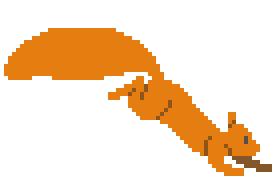

# Squirrel Away

_**[Live demo](https://levi.dev/squirrel)**_

This simple game showcases procedural pathfinding across 2D-platformer surfaces using the [Surfacer](https://github.com/snoringcatgames/surfacer/) framework.

In this game, the user can click anywhere in the level, and the cat character will then jump, walk, and climb across platforms in order to reach that target destination.

## Software used

-   [Surfacer](https://github.com/snoringcatgames/surfacer/): A framework that enables procedural path-finding across 2D platforms.
-   [Godot Scaffold](https://github.com/snoringcatgames/godot-scaffold/): A framework that provides some general app infrastructure.
-   [Godot](https://godotengine.org/): Game engine.
-   [Piskel](https://www.piskelapp.com/user/5663844106502144): Pixel-art image editor.
-   [Aseprite](https://www.aseprite.org/): Pixel-art image editor.
-   [Bfxr](https://www.bfxr.net/): Sound effects editor.
-   [DefleMask](https://deflemask.com/): Chiptune music tracker.

## Licenses

-   All code is published under the [MIT license](LICENSE).
-   All art assets (files under `assets/images/`, `assets/music/`, and `assets/sounds/`) are published under the [CC0 1.0 Universal license](https://creativecommons.org/publicdomain/zero/1.0/deed.en).
-   This project depends on various pieces of third-party code that are licensed separately. Here are lists of these third-party licenses:
    -   [addons/scaffold/scaffold_third_party_licenses.gd](./addons/scaffold/scaffold_third_party_licenses.gd)
    -   [addons/surfacer/surfacer_third_party_licenses.gd](./addons/surfacer/surfacer_third_party_licenses.gd)
    -   [src/squirrel_away_third_party_licenses.gd](./src/squirrel_away_third_party_licenses.gd)

  

