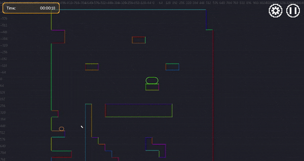
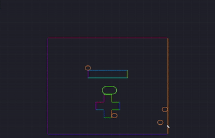

# Surfacer

  

--------

> **NOTE:** _Consider this a **pre-alpha** release. This framework still has many rough edges, is still changing a lot, and is possibly a lot more inflexible than you would need (it makes a lot of assumptions about how you've structured your app)._

--------

> _**[Live demo](https://snoringcat.games/play/squirrel-away) ([source code](https://github.com/snoringcatgames/squirrel_away))**_
> 
> _**[Godot Asset Library](https://godotengine.org/asset-library/asset/968)**_
>
> _**[Extended tutorial on how this AI works](https://devlog.levi.dev/2021/09/building-platformer-ai-from-low-level.html)**_

_An **AI and pathfinding** 2D-platformer framework for [Godot](https://godotengine.org/)._

_Enables point-and-click platformers!_

_"Surfacer": Like a platformer, but with walking, climbing, and jumping on all surfaces!_

--------

> **NOTE:** _This framework depends the separate [Scaffolder](https://github.com/snoringcatgames/scaffolder/) library. You'll need to add both of these libraries to your `addons/` folder._

--------

  

## What is this?

**tl;dr**: Surfacer works by **pre-parsing** a level into a **"platform graph"**. The **nodes** are represented by points along the different surfaces in the level (floors, walls, and ceilings). The **edges** are represented by possible movement trajectories between points along surfaces. There are different types of edges for different types of movement (e.g., jumping from a floor to a floor, falling from a wall, walking along a floor). At run time, **[A* search](https://en.wikipedia.org/wiki/A*_search_algorithm)** is used to calculate a path to a given destination.

Some features include:
-   Surfacer includes a powerful **character-behavior system** for easily creating a character AI with high-level behaviors like "wander", "follow", "run-away", "return".
-   Easy-to-use point-and-click navigation for player-controlled characters.
-   [Configurable movement parameters](./src/platform_graph/edge/models/movement_params.gd) on a per-character basis (e.g., horizontal acceleration, jump power, gravity, collision boundary shape and size, which types of edge movement are allowed).
-   Level creation using Godot's standard pattern with a [TileMap in the 2D scene editor](https://docs.godotengine.org/en/3.2/tutorials/2d/using_tilemaps.html).
-   Preparsing the level into a platform graph, and using A* search for efficient path-finding at runtime.
-   A powerful inspector for analyzing the platform graph, in order to debug and better understand how edges were calculated.
-   Walking on floors, climbing on walls, climbing on ceilings, jumping and falling from anywhere.
-   [Variable-height jump and fast-fall](https://kotaku.com/the-mechanics-behind-satisfying-2d-jumping-1761940693).
-   Adjusting movement trajectories to move around intermediate surfaces (such as jumping over a wall or around a floor).

## But why?

Because there aren't many other tools out there for intelligent pathfinding in a platformer.

The vast majority of platformers use pretty simple npc AI for movement--for example:
-   Walk to edge, turn around, repeat.
-   Jump continuously, moving forward.
-   Move with a regular bounce or surface-following pattern.
-   Move horizontally toward the player character, "floating" vertically as needed in order to move around obstacles and platforms.

Most examples of more sophisticated AI pathfinding behavior are still pretty limited. One common technique uses machine-learning and is trained by hundreds to thousands of human-generated jumps on an explicit pre-fabricated level. This makes level-generation difficult and is not flexible to dynamic platform creation/movement.

There are two key reasons why good path-finding AI isn't really used in platformers:
1.  It's hard to implement right; there is a lot of math involved, and there are a lot of different edge cases to account for.
2.  Dumb AI is usually plenty effective on its own to create compelling gameplay. The player often doesn't really notice or care how simple the behavior is.

But there are use-cases for which we really benefit from an AI that can accurately immitate the same movement mechanics of the character. One example is if we want to be able to control the character by tapping on locations that they should move toward through the level. Another example is if we want to have a flexible game mode in which an npc can swap in for a player character depending on how many players are present.

## Learn more!

-   [Getting set up](./docs/getting_set_up.md)
-   [The platform-graph AI](./docs/platform_ai.md)
-   [The platform-graph inspector](./docs/inspector.md)
-   [Notable limitations](./docs/limitations.md)
-   [Other features](./docs/other_features.md)

You can also read more about how Surfacer's AI and movement works in [this **tutorial series**](https://devlog.levi.dev/2021/09/building-platformer-ai-from-low-level.html).

  

## Licenses

-   All code is published under the [MIT license](LICENSE).
-   This project depends on various pieces of third-party code that are licensed separately. [Here is a list of these third-party licenses](./src/config/surfacer_third_party_licenses.gd).

  

