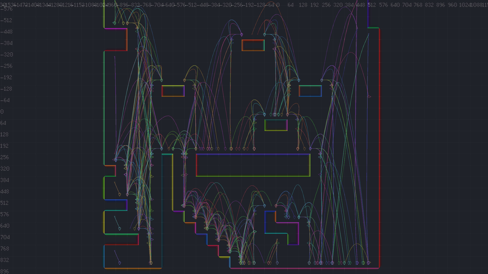
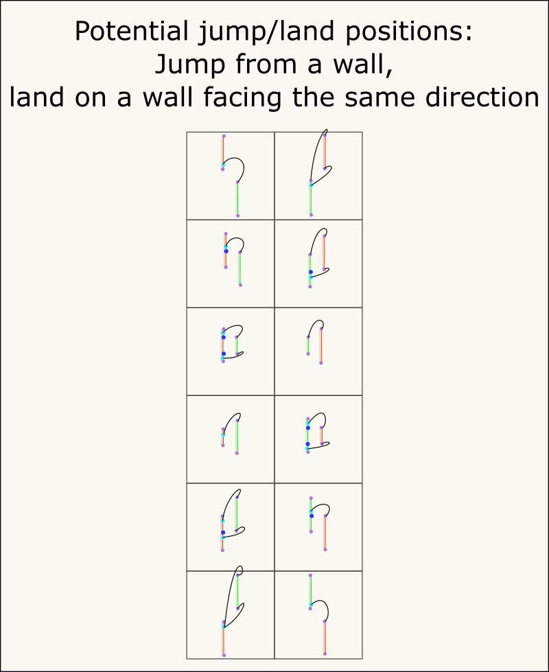
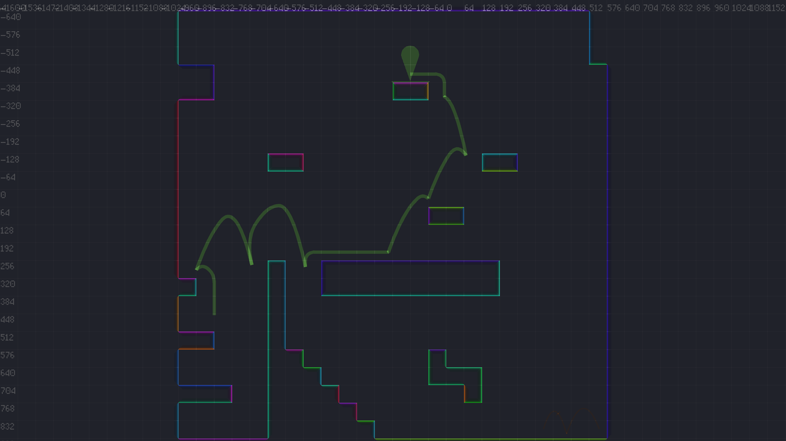
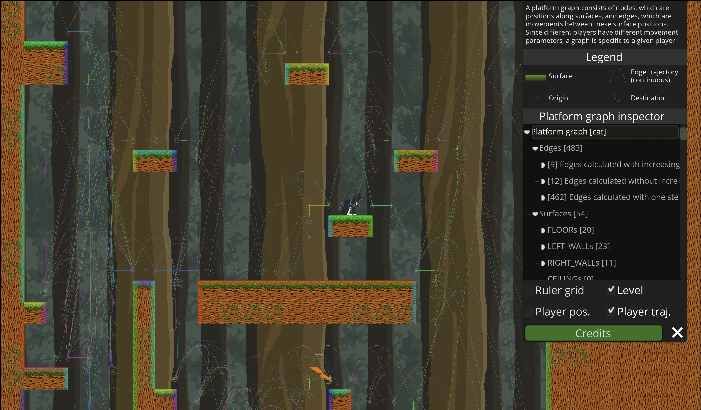
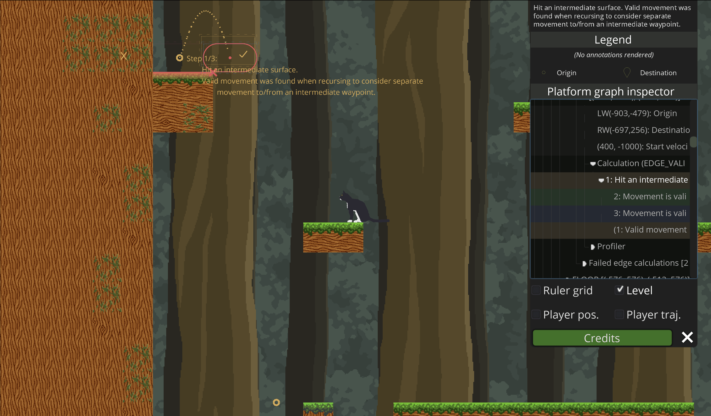

# Surfacer

<p align="center">
  
</p>

> _**[Live demo](https://levi.dev/squirrel)**_
> 
> _**[Demo source](https://github.com/snoringcatgames/squirrel-away)**_

_A procedural pathfinding 2D-platformer framework for [Godot](https://godotengine.org/)._

_"Surfacer": Like a platformer, but with walking, climbing, and jumping on all surfaces!_

--------

> **NOTE:** _This framework is still in development._

--------



**tl;dr**: Surfacer works by **pre-parsing** a level into a **"platform graph"**. The **nodes** are represented by points along the different surfaces in the level (floors, walls, and ceilings). The **edges** are represented by possible movement trajectories between points along surfaces. There are different types of edges for different types of movement (e.g., jumping from a floor to a floor, falling from a wall, walking along a floor). At run time, **[A* search](https://en.wikipedia.org/wiki/A*_search_algorithm)** is used to calculate a path to a given destination.

Some features include:
-   Walking on floors, climbing on walls, climbing on ceilings, jumping and falling from anywhere.
-   [Variable-height jump and fast-fall](https://kotaku.com/the-mechanics-behind-satisfying-2d-jumping-1761940693).
-   Adjusting movement trajectories around intermediate surfaces (such as jumping over a wall or under an overhang).
-   Configurable movement parameters on a per-player basis (e.g., horizontal acceleration, jump power, gravity, collision boundary shape and size, which types of edge movement are allowed).
-   Level creation using Godot's standard pattern with a [TileMap in the 2D scene editor](https://docs.godotengine.org/en/3.2/tutorials/2d/using_tilemaps.html).
-   Preparsing the level into a platform graph, and using A* search for efficient path-finding at runtime.
-   A powerful inspector for analyzing the platform graph, in order to debug and better understand how edges were calculated.

## Getting set up

Probably the easiest way to get set up is to copy the [Squirrel Away example app](https://github.com/snoringcatgames/squirrel-away), and then adjust it to fit your needs.

-   Add the [Scaffolder](https://github.com/snoringcatgames/scaffolder/) library to your `addons/` folder.
    -   This is a framework that provides some general-purpose infrastructure that can be useful for adding a bunch of app boilerplate that you might want for your game.
    -   Surfacer currently depends on this additional framework.
    -   See the Scaffolder [README](https://github.com/snoringcatgames/scaffolder/README.md) for details on setting it up.
-   Add the [Surfacer](https://github.com/snoringcatgames/surfacer/) library to your `addons/` folder.
-   Define `Surfacer` as an AutoLoad (in Project Settings).
    -   It should point to the path `res://addons/surfacer/src/SurfacerConfig.gd`.
    -   It should be the second AutoLoad in the list, just after `Gs` (for Scaffolder).
-   Configure both the Surfacer and Scaffolder frameworks by calling `SurfacerBootstrap.on_app_ready` at the start of your Main Scene.

## Buy why?

Because there aren't many other good tools out there for intelligent pathfinding in a platformer.

The vast majority of platformers use pretty simple computer-player AI for movement--for example:
-   Walk to edge, turn around, repeat.
-   Jump continuously, moving forward.
-   Move with a regular bounce or surface-following pattern.
-   Move horizontally toward the human player, "floating" vertically as needed in order to move around obstacles and platforms.

Most examples of more sophisticated AI pathfinding behavior are usually still pretty limited. One common technique uses machine-learning and is trained by hundreds to thousands of human-generated jumps on an explicit pre-fabricated level. This makes level-generation difficult and is not flexible to dynamic platform creation/movement.

There are two key reasons why good path-finding AI isn't really used in platformers:
1.  It's hard to implement right; there is a lot of math involved, and there are a lot of different edge cases to account for.
2.  Dumb AI is usually plenty effective on its own to create compelling gameplay. The user often doesn't really notice or care how simple the behavior is.

But there are use-cases for which we really benefit from an AI that can accurately immitate the same movement mechanics of the player. One example is if we want to be able to control the player by tapping on locations that they should move through the level toward. Another example is if we want to have a flexible game mode in which a computer player can swap in for a human player depending on how many humans are present.

## Platformer AI

### The platform graph: Pre-parsing the world

Surfacer depends on the level being represented as a [`TileMap`](https://docs.godotengine.org/en/stable/classes/class_tilemap.html#class-tilemap).

In order for our AI to traverse our world, we first need to parse the world into a platform graph. We do this up-front, when the level is loaded, so that we can efficiently search the graph at run time. Dynamic updates to the graph can be performed at runtime, but these could be expensive if not done with care.

The nodes of this graph correspond to positions along distinct surfaces. Since our players can walk on floors, climb on walls, and climb on ceilings, we store floor, wall, and ceiling surfaces.

The edges of this graph correspond to a type of movement that the player could perform in order to move from one position on a surface node to another.
-   These edges are directional, since the player may be able to move from A to B but not from B to A.
-   The ends of an edge could be along the same surface or on different surfaces (e.g., for climbing up a wall vs jumping from a floor).
-   There could be multiple edges between a single pair of nodes, since there could be multiple types of movement that could get the player from the one to the other.
-   These edges are specific to a given player type. If we need to consider a different player that has different movement parameters, then we need to calculate a separate platform graph for that player.


### Nodes: Parsing a Godot `TileMap` into surfaces

> **NOTE:** The following algorithm assumes that the given `TileMap` only uses tiles with convex collision boundaries.

#### Parse individual tiles into their constituent surfaces

-   Map each `TileMap` cell into a polyline that corresponds to the top-side/floor portion of its collision polygon.
    -   Calculate whether the collision polygon's vertices are specified in a clockwise order.
        -   Use this to determine the iteration step size.
            -   `step_size = 1` if clockwise; `step_size = -1` if counter-clockwise.
        -   Regardless of whether the vertices are specified in a clockwise order, we will iterate over them in clockwise order.
    -   Find both the leftmost and rightmost vertices.
    -   Start with the leftmost vertex.
        -   If there is a wall segment on the left side of the polygon, then this vertex is part of it.
        -   If there is no wall segment on the left side of the polygon, then this vertex must be the cusp between a preceding bottom-side/ceiling segment and a following top-side/floor segment (i.e., the previous segment is underneath the next segment).
            -   Even if there is no segment along one side, we store a surface for that side; this surface is only represented by a single point.
    -   Iterate over the following vertices until we find a non-wall segment (this could be the first segment, the one connecting to the leftmost vertex).
        -   Wall segments are distinguished from floor/ceiling segments according to their angle. This is configurable, but typically, a segment up to 45-degrees is a floor/ceiling and a segment steeper than 45-degrees is a wall.
    -   This non-wall segment must be the start of the top-side/floor polyline.
    -   Iterate, adding segments to the result polyline, until we find either a wall segment or the rightmost vertex.
    -   We then also save a mapping from a `TileMap` cell index to each of the different surfaces we've calculated as existing in that cell.
-   Repeat the above process for the right-side, left-side, and bottom-side surfaces.

#### Remove internal surfaces

> **NOTE:** This will only detect internal surface segments that are equivalent with another internal segment. But for grid-based tiling systems, this can often be enough.

-   Check for pairs of floor+ceiling segments or left-wall+right-wall segments, such that both segments share the same vertices.
-   Remove both segments in these pairs.

#### Merge any connecting surfaces

-   Iterate across each floor surface A.
-   Nested iterate across each other floor surface B.
    -   Ideally, we should be using a spatial data structure that allows us to only consider nearby surfaces during this nested iteration (such as an R-Tree).
-   Check whether A and B form a "continuous" surface.
    -   A and B are both polylines that only have two end points.
    -   Just check whether either endpoint of A equals either endpoint of B.
        -   Actually, our original `TileMap` parsing results in every surface polyline being stored in clockwise order, so we only need to compare the end of A with the start of B and the start of A with the end of B.
-   If they do:
    -   Merge B into A.
    -   Optionally, remove any newly created redundant internal colinear points.
    -   Remove B from the surface collection.
-   Repeat the iteration until no merges were performed.

#### Record adjacent neighbor surfaces

-   Every surface should have both adjacent clockwise and counter-clockwise neighbor surfaces.
-   Use a similar process as above for finding surfaces with matching end positions.

### Edges: Calculating jump movement trajectories

**tl;dr**: The Surfacer framework uses a procedural approach to calculate trajectories for movement between surfaces. The algorithms used rely heavily on the classic [one-dimensional equations of motion for constant acceleration](https://physics.info/motion-equations/). These trajectories are calculated to match to the same abilities and limitations that are exhibited by corresponding human-controlled movement. After the trajectory for an edge is calculated, it is translated into a simple instruction/input-key start/end sequence that should reproduce the calculated trajectory.

> **NOTE:** A machine-learning-based approach would probably be a good alternate way to solve this general problem. However, one perk of a procedural approach is that it's relatively easy to understand how it works and to modify it to perform better for any given edge-case (and there are a _ton_ of edge-cases).

#### The high-level steps

-   Determine how high we need to jump in order to reach the destination.
-   If the destination is out of reach (vertically or horizontally), ignore it.
-   Calculate how long it will take for vertical motion to reach the destination from the origin.
-   We will define the movement trajectory as a combination of two independent components: a "vertical step" and a "horizontal step". The vertical step is based primarily on on the jump duration calculated above.
-   Calculate the horizontal step that would reach the destination displacement over the given duration.
-   Check for any unexpected collisions along the trajectory represented by the vertical and horizontal steps.
    -   If there is an intermediate surface that the player would collide with, we need to try adjusting the jump trajectory to go around either side of the colliding surface.
        -   We call these points that movement must go through in order to avoid collisions, "waypoints".
        -   Recursively check whether the jump is valid to and from either side of the colliding surface.
        -   If we can't reach the destination when moving around the colliding surface, then try backtracking and consider whether a higher jump height from the start would get us there.
    -   If there is no intermediate collision, then we can calculate the ultimate edge movement instructions for playback based on the vertical and horizontal steps we've calculated.

#### Some important aspects

-   We treat horizontal and vertical motion as independent to each other. This greatly simplifies our calculations.
    -   We calculate the necessary jump duration--and from that the vertical component of motion--up-front, and use this to determine times for each potential step and waypoint of the motion. Knowing these times up-front makes the horizontal min/max calculations easier.
-   We have a broad-phase check to quickly eliminate possible surfaces that are obviously out of reach.
    -   This primarily looks at the horizontal and vertical distance from the origin to the destination.

#### Calculating "good" jump and land positions

Deciding which jump and land positions to base an edge calculation off of is non-trivial. We could just try calculating edges for a bunch of different jump/land positions for a given pair of surfaces. But edge calculations aren't cheap, and executing too many of them impacts performance. So it's important that we carefully choose "good" jump/land positions that have a relatively high likelihood of producing a valid and efficient edge.

Additionally, when jumping from a floor, we need to determine what initial horizontal velocity to use for the edge calculation. This horizontal start velocity can then influence the jump/land positions.

-   Some interesting jump/land positions for a surface include the following:
    -   Either end of the surface.
    -   The closest position along the surface to either end of the other surface.
        -   This closest position, but with a slight offset to account for the width of the player.
        -   This closest position, but with an additional offset to account for horizontal or vertical displacement with minimum jump time and maximum horizontal velocity.
            -   This offset becomes important when considering jumps that start with max-speed horizontal velocity, which could otherwise overshoot the land position if we didn't account for the offset.
    -   The closest interior position along the surface to the closest interior position along the other surface.
    -   The position along a horizontal surface that is behind the overall connected region that the vertical land surface is a part of.
        -   This position is important if we need to consider movement around behind a wall that then lands on the top of the wall.
-   We try to minimize the number of jump/land positions returned, since having more of these greatly increases the overall time to parse the platform graph.
-   We usually consider surface-interior points before surface-end points (which usually puts shortest distances first).
-   We also decide start velocity when we decide the jump/land positions.
    -   We only ever consider start velocities with zero or max speed.
-   Additionally, we often quit early as soon as we've calculated the first valid edge for a given pair of surfaces.
    -   In order to decide whether to skip an edge calculation for a given jump/land position pair, we look at how far away it is from any other jump/land position pair that we already found a valid edge for, on the same surface, for the same surface pair. If it's too close, we skip it.
    -   This is another important performance optimization.

Unfortunately, most jump/land position calculations are highly dependent on the types and spatial arrangement of the two surfaces. There are many possible combinations, and the most of these combinations must be considered individually. The following diagrams illustrate the many different jump/land combinations.





#### Calculating the start velocity for a jump

-   In the general case, we can't know at build-time what direction along a surface the player will
    be moving from when they need to start a jump.
-   Unfortunately, using start velocity x values of zero for all jump edges tends to produce very
    unnatural composite trajectories (similar to using perpendicular Manhatten distance routes
    instead of more diagonal routes).
-   So, we can assume that for surface-end jump-off positions, we'll be approaching the jump-off
    point from the center of the edge.
-   And for most edges we should have enough run-up distance in order to hit max horizontal speed
    before reaching the jump-off point--since horizontal acceleration is relatively quick.
-   Also, we only ever consider velocity-start values of zero or max horizontal speed. Since the
    horizontal acceleration is quick, most jumps at run time shouldn't need some medium-speed. And
    even if they did, we force the initial velocity of the jump to match expected velocity, so the
    jump trajectory should proceed as expected, and any sudden change in velocity at the jump start
    should be acceptably small.

#### Calculating the total jump duration (and the vertical step for the edge)

-   At the start of each edge-calculation traversal, we calculate the minimum total time needed to reach the destination.
    -   If the destination is above, this might be the time needed to rise that far in the jump.
    -   If the destination is below, this might be the time needed to fall that far (still taking into account any initial upward jump-off velocity).
    -   If the destination is far away horizontally, this might be the time needed to move that far horizontally (taking into account the horizontal movement acceleration and max speed).
    -   The greatest of these three possibilities is the minimum required total duration of the jump.
-   The minimum peak jump height can be determined from this total duration.
-   All of this takes into account our variable-height jump mechanic and the difference in slow-ascent and fast-fall gravities.
    -   With our variable-height jump mechanic, there is a greater acceleration of gravity when the player either is moving downward or has released the jump button.
    -   If the player releases the jump button before reaching the maximum peak of the jump, then their current velocity will continue pushing them upward, but with the new stronger gravity.
    -   To determine the duration to the jump peak height in this scenario, we first construct two instances of one of the basic equations of motion--one for the former part of the ascent, with the slow-ascent gravity, and one for the latter part of the ascent, with the fast-fall gravity. We then use algebra to substitute the equations and solve for the duration.

#### Calculating the horizontal steps in an edge

-   If we decide whether a surface could be within reach, we then check for possible collisions between the origin and destination.
    -   To do this, we simulate frame-by-frame motion using the same physics timestep and the same movement-update function calls that would be used when running the game normally. We then check for any collisions between each frame.
-   If we detect a collision, then we define two possible "waypoints"--one for each end of the collided surface.
    -   In order to make it around this intermediate surface, we know the player must pass around one of the ends of this surface.
    -   These waypoints we calculate represent the minimum required deviation from the player's original path.
-   We then recursively check whether the player could move to and from each of the waypoints.
    -   We keep the original vertical step and overall duration the same.
    -   We can use that to calculate the time and vertical state that must be used for the waypoint.
    -   Then we only really consider whether the horizontal movement could be valid within the the given time limit.
-   If so, we concatenate and return the horizontal steps required to reach the waypoint from the original starting position and the horizontal steps required to reach the original destination from the waypoint.

#### Backtracking to consider a higher max jump height

-   Sometimes, a waypoint may be out of reach, when we're calculating horizontal steps, given the current step's starting position and velocity.
-   However, maybe the waypoint could be within reach, if we had originally jumped a little higher.
-   To account for this, we backtrack to the start of the overall movement traversal and consider whether a higher jump could reach the waypoint.
    -   The destination waypoint is first updated to support a new jump height that would allow for a previously-out-of-reach intermediate waypoint to also be reached.
    -   Then all steps are re-calculated from the start of the movement, while considering the new destination state.
-   If it could, we return that result instead.

#### Waypoint calculations

-   We calculate waypoints before steps.
    -   We calculate a lot of state to store on them, and then depend on this state during step calculation.
    -   Some of this state includes:
        -   The time for passing through the waypoint (corresponding to the overall jump height and edge duration).
        -   The horizontal direction of movement through the waypoint (according to the direction of travel from the previous waypoint or according to the direction of the surface).
        -   The min and max possible x-velocity when the movement passes through this waypoint.
            -   With a higher speed through a waypoint, we could reach further for the next waypoint, or we could be stuck overshooting the next waypoint. So it's useful to calculate the range of possible horizontal velocities through a waypoint.
        -   The actual x-velocity for movement through the waypoint is calculated later when calculating the cooresponding movement step.
            -   We typically try to use an x-velocity that will minimize speed through the waypoint, while still satisfying the horizontal step displacement and the waypoint's min/max limitations.
-   Here's the sequence of events for waypoint calculations:
    -   Start by calculating origin and destination waypoints.
        -   For the origin waypoint, min, max, and actual x-velocity are all zero.
        -   For the destination waypoint, min and max are assigned according to how acceleration can be applied during the step (e.g., at the start or at the end of the interval).
    -   Then, during step calculation traversal, when a new intermediate waypoint is created, its min and max x-velocity are assigned according to both the min and max x-velocity of the following waypoint and the actual displacement and duration of the step from the new waypoint to the next waypoint.
    -   Intermediate waypoints are calculated with pre-order tree traversal.
      -   This poses a small problem:
        -   The calculation of a waypoint depends on the accuracy of the min/max x-velocity of it's next waypoint.
        -   However, the min/max x-velocity of the next waypoint could need to be updated if it in turn has a new next waypoint later on.
        -   Additionally, a new waypoint could be created later on that would become the new next waypoint instead of the old next waypoint.
        -   To ameliorate this problem, everytime a new waypoint is created, we update its immediate neighbor waypoints.
        -   These updates do not solve all cases, since we may in turn need to update the min/max x-velocities and movement sign for all other waypoints. And these updates could then result in the addition/removal of other intermediate waypoints. But we have found that these two updates are enough for most cases. If we detect that a neigbor waypoint would be invalidated during an update, we abandon the edge calculation, which could result in a false-negative result.
    -   Steps are calculated with in-order tree traversal (i.e., in the same order they'd be executed when moving from origin to destination).

#### Fake waypoints

-   When calcuting steps to navigate around a collision with a ceiling or floor surface, sometimes one of the two possible waypoints is what we call "fake".
-   A fake waypoint corresponds to the left side of the floor/ceiling surface when movement from the previous waypoint is rightward (or to the right side when movement is leftward).
-   In this case, movement will need to go around both the floor/ceiling as well as its adjacent wall surface.
-   The final movement trajectory should not end-up moving through the fake waypoint.
-   The actual waypoint that the final movement should move through, is instead the "real" waypoint that cooresponds to the far edge of this adjacent wall surface.
-   So, when we find a fake waypoint, we immediately replace it with its adjacent real waypoint.
-   Example scenario:
  -   Origin is waypoint #0, Destination is waypoint #3
  -   Assume we are jumping from a low-left platform to a high-right platform, and there is an intermediate block in the way.
  -   Our first step attempt hits the underside of the block, so we try waypoints on either side.
  -   After trying the left-hand waypoint (#1), we then hit the left side of the block. So we then try a top-side waypoint (#2).
      -   (Bottom-side fails the surface-already-encountered check).
  -   After going through this new left-side (right-wall), top-side waypoint (#2), we can successfully reach the destination.
  -   With the resulting scenario, we shouldn't actually move through both of the intermediate waypoints (#1 and #2). We should should instead skip the first intermediate waypoint (#1) and go straight from the origin to the second intermediate waypoint (#2).

> TODO: screenshot of example scenario

#### Collision calculation madness

**tl;dr**: Godot's collision-detection engine is very broken. We try to make it work for our
pathfinding, but there are still false negatives and rough edges.

Here's a direct quote from a comment in Godot's underlying collision-calculation logic:

> give me back regular physics engine logic<br>
> this is madness<br>
> and most people using this function will think<br>
> what it does is simpler than using physics<br>
> this took about a week to get right..<br>
> but is it right? who knows at this point..<br>

(https://github.com/godotengine/godot/blob/a7f49ac9a107820a62677ee3fb49d38982a25165/servers/physics_2d/space_2d_sw.cpp#L692)

Some known limitations and rough edges include:
-   When a [`KinematicBody2D`](https://docs.godotengine.org/en/stable/classes/class_kinematicbody2d.html) is sliding around a corner of another collidable, Godot can sometimes calculate the wrong results (oppositite direction) for `is_floor()`/`is_ceiling()`.
-   Inconsistency between the behavior of the [`KinematicBody2D`](https://docs.godotengine.org/en/stable/classes/class_kinematicbody2d.html) and [`Physics2DDirectSpaceState`](https://docs.godotengine.org/en/stable/classes/class_physics2ddirectspacestate.html) collision APIs.
    -   We were originally using the Physics2DDirectSpaceState for most of our graph calculations. However, this API seems to be more broken than the KinematicBody2D API. Also, we're using the KinematicBody2D API at run time, so we see more consistent results by using the KinematicBody2D API at build time as well.

### Navigator: Using the platform graph to move from A to B

Once the platform graph has been parsed, finding and moving along a path through the graph is relatively straight-forward. The sequence of events looks like the following:

-   Given a target point to navigate towards and the player's current position.
-   Find the closest point along the closest surface to the target point.
-   Use A* search to find a path through the graph from the origin to the destination.
    -   We can use distance or duration as the edge weights.
-   Execute playback of the instruction set for each edge of the path, in sequence.



#### Dynamic edge optimization according to runtime approach

At runtime, after finding a path through build-time-calculated edges, we try to optimize the jump-off points of the edges to better account for the direction that the player will be approaching the edge from. This produces more efficient and natural movement. The build-time-calculated edge state would only use surface end-points or closest points. We also take this opportunity to update start velocities to exactly match what is allowed from the ramp-up distance along the edge, rather than either the fixed zero or max-speed value used for the build-time-calculated edge state.

#### Edge instructions playback

When we create the edges, we represent the movement trajectories according to the sequence of instructions that would produce the trajectory. Each instruction is simply represented by an ID for the relevant input key, whether the key is being pressed or released, and the time. The player movement system can then handle these input key events in the same way as actual human-triggered input key events.

#### Correcting for runtime vs buildtime trajectory discrepancies

When executing edge instructions, the resulting run-time trajectory is usually slightly off from the expected trajectory that was pre-calculated when creating the edge. This variance is usually pretty minor, but, just in case, a given player can be configured to use the exact pre-calculated edge trajectory rather than the run-time version.

Theoretically, this discrepancy shouldn't exist, and we should be able to eliminate it at some point.

## Platform graph inspector

As you might imagine, the calculations for these edges can get quite complicated. To make these calculations easier to understand and debug, we created a powerful platform graph inspector. This can be accessed from the inspector panel (the gear icon in the top-right corner of the screen).



The inspector is a tree-view widget with the following structure:

```
 - Platform graph [player_name]
   - Edges [#]
     - [#] Edges calculated with increasing jump height
       - JUMP_INTER_SURFACE_EDGEs [#]
         - [(x,y), (x,y)]
           - Profiler
             - ...
           - EDGE_VALID_WITH_INCREASING_JUMP_HEIGHT [1]
             - 1: Movement is valid.
             - ...
         - ...
       - ...
     - [#] Edges calculated without increasing jump height
       - ...
     - [#] Edges calculated with one step
       - ...
   - Surfaces [#]
     - FLOORs [#]
       - [(x,y), (x,y)]
         - _# valid outbound edges_
         - _Destination surfaces:_
         - FLOOR [(x,y), (x,y)]
           - JUMP_INTER_SURFACE_EDGEs [#]
             - [(x,y), (x,y)]
               - Profiler
                 - ...
               - EDGE_VALID_WITH_INCREASING_JUMP_HEIGHT [1]
                 - 1: Movement is valid.
                 - ...
             - ...
             - Failed edge calculations [#]
               - REASON_FOR_FAILING [(x,y), (x,y)]
                 - Profiler
                   - ...
                 - REASON_FOR_FAILING [#]
                   - 1: Step result info
                     - 2: Step result info
                     - ...
                   - ...
                 - ...
               - ...
           - ...
         - ...
       - ...
     - ...
   - Profiler
     - ...
     - Global counts
       - # total surfaces
       - # total edges
       - # JUMP_INTER_SURFACE_EDGEs
       - ...
```

Each entry in this inspector tree is encoded with annotation information which will render debugging info over the level for the corresponding entity. Additionally, each entry contains a detailed description. These are both shown when selecting the entry.



## Annotators

We include a large collection of annotators that are useful for visually debugging calculation of the platform graph. Some of these are rendered by selecting entries in the platform graph inspector and some of them can be toggled through checkboxes in the inspector panel.

## Movement parameters

We support a large number of flags and parameters for adjusting various aspects of player/movement/platform-graph behavior. For a complete list of these params, see [movement_params.gd](./framework/platform_graph/edge/models/movement_params.gd).

## Extensible framework for custom movement mechanics

> TODO: Describe this system. For now, look at the code under `src/player/action/action_handlers/` for examples.

> **NOTE:** The procedural pathfinding logic is implemented independently of this framework. So, you can use this to add cool new movement for human-controlled movement, but the automatic pathfinding will only know about the specific default mechanics that it was designed around.

## Notable limitations

-   Our build-time graph calculations take a long time, especially for a level with lots of surfaces (such as a big level, or a level with a small cell size).
-   There is slight discrepancy between discrete and continuous trajectories. The former is what we see from movement produced by the frame-by-frame application of gravity and input actions on the player. The latter is what we see from our precise numerical analysis of algebraic equations when pre-calculating the platform graph. We support a few different techniques for reconciling this:
    -   `MovementParams.syncs_player_velocity_to_edge_trajectory`: When this flag is enabled, the player's run-time _velocity_ will be forced to match the expected pre-calculated (continuous) velocity for the current frame in the currently executing platform graph edge.
    -   `MovementParams.syncs_player_position_to_edge_trajectory`: When this flag is enabled, the player's run-time _position_ will be forced to match the expected pre-calculated (continuous) velocity for the current frame in the currently executing platform graph edge.
    -   `MovementParams.retries_navigation_when_interrupted`: When this flag is enabled, the navigator will re-attempt navigation to the original destination from the current position whenever it detects that the player has hit an unexpected surface, which is what can happen when the run-time discrete trajectories don't match build-time continuous trajectories.
-   When two surfaces face each other and are too close for thte player to fit between (plus a margin of a handful of extra pixels), our graph calculations can produce some false positives.
-   Surfacer doesn't currently fully support surfaces that consist of one point.
-   Our platform graph calculations produce false negatives for some types of jump edge scenarios:
    -   An jump edge that needs to displace the jump position in order to make it around an intermediate waypoint with enough horizontal velocity to then reach the destination.
        -   For example, if the player is jumping from the bottom of a set of stair-like surfaces, the jump position ideally wouldn't be as close as possible to the first rise of the first step (because they can't start accelerating horizontally until vertically clearing the top of the rise). Instead, if the player jumps from a slight offset from the rise, then they can pass over the rise with more speed, which lets them travel further during the jump.
    -   A single horizontal step that needs multiple different sideways-movement instructions (i.e., accelerating to both one side and then the other in the same jump):
        -   For example, backward acceleration in order to not overshoot the end position as well as forward acceleration to then have enough step-end x velocity in order to reach the following waypoint for the next step.
-   Surfacer is opinionated. It requires that you structure your app using TileMaps, specific node groups, and by subclassing certain framework classes in order to create players.
    -   You need to define a set of input actions with the following names (via Project Settings > Input Map):
        -   jump
        -   move_up
        -   move_down
        -   move_left
        -   move_right
        -   dash
        -   zoom_in
        -   zoom_out
        -   pan_up
        -   pan_down
        -   pan_left
        -   pan_right
        -   face_left
        -   face_right
        -   grab_wall
    -   Your level collidable foreground tiles must be defined in a TileMap that belongs to the "surfaces" node group.
    -   Surfacer uses a very specific set of movement mechanics.
        -   Fortunately, this set includes most features commonly used in platforms and is able to provide pretty sophisticated movement.
        -   But the procedural path-finding doesn't know about complex platformer mechanics like special in-air friction or coyote time.
    -   The Surfacer framework isn't yet decoupled from the Squirrel Away demo app logic.

## Future work

For a list of planned future work items / TODOs, see [Main.gd](./Main.gd).

Some high-level planned future features include:
-   Add an option for saving/loading the platform graph instead of parsing it each time.
-   Bypass the Godot collision system at runtime, and use only the pre-calculated expected edge trajectories from the platform graph.
-   More intelligent squirral avoidance.
-   Better game-play goal, with an event that happens when you catch the squirrel.
-   Decouple the Surface framework logic from the Squirrel Away demo logic.
-   Add Surfacer to the Godot Asset Library.
-   Use an R-Tree for faster surface lookup.
-   Support for fall-through floors and walls in the platform graph.
-   Support for double jumps in the platform graph.
-   Support for dashes in the platform graph.
-   Support for surfaces that face each other and are too close for player to fit between.
-   Support for surfaces of one point.
-   Support an alternate, template-based edge calculation pattern, which should be able to offer faster build times and still have quick run times.
-   Add networking.
-   Procedural level generation.

## Tests

_> **NOTE:** Sadly, the tests are not set up to automatically run on presubmit, so some of the tests are severely out-of-date and broken._

Surfacer uses the [Gut tool](https://github.com/bitwes/Gut) for writing and running unit tests.

## Licenses

-   All code is published under the [MIT license](LICENSE).
-   This project depends on various pieces of third-party code that are licensed separately. [Here is a list of these third-party licenses](./src/surfacer_third_party_licenses.gd).

<p align="center">
  
</p>
