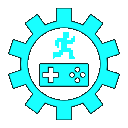

# Godot Scaffold

> _**[Example app](https://github.com/snoringcatgames/squirrel-away)**_

This is an opinionated framework that provides a bunch of general-purpose application scaffolding and utility functionality for Godot games.

## Getting set up

Probably the easiest way to get set up is to copy the [Squirrel Away example app](https://github.com/snoringcatgames/squirrel-away), and then adjust it to fit your needs.

### Project Settings

Some of these are just my personal preference, some are important for the framework to run correctly.

-   Application > Config:
    -   Name
    -   Icon
    -   Quit On Go Back: false
-   Application > Run:
    -   Main Scene
-   Application > Boot Splash:
    -   Image
    -   Bg Color: Must match `Gs.screen_background_color`
-   Rendering > Quality:
    -   Use Pixel Snap: true
    -   Framebuffer Allocation: 2D Without Sampling
    -   Framebuffer Allocation.mobile: 2D Without Sampling
-   Rendering > Environment:
    -   Default Clear Color: Match `Gs.screen_background_color`
    -   Default Environment: I usually move this out from the top-level directory.
-   Display > Window:
    -   Size > Width/Height: Must match `Gs.default_game_area_size`.
    -   Stretch > Mode: disabled
    -   Stretch > Aspect: expand
-   Input Devices > Pointing:
    -   Emulate Touch From Mouse: true
    -   Ios > Touch Delay: 0.005
-   Layer Names:
    -   Name these!

### `Gs`

All of the Godot Scaffold functionality is globally accessible through the `Gs` AutoLoad.

-   Define `Gs` as an AutoLoad (in Project Settings).
    -   It should point to the path `res://addons/scaffold/src/ScaffoldConfig.gd`.
    -   It should be the first AutoLoad in the list.
-   Configure the Godot Scaffold framework by calling `ScaffoldBootstrap.on_app_ready` at the start of your Main Scene.

> **NOTE:** `Gs` stands for "Godot Scaffold", in case that's helful to know!

If you want to override or extend any Godot Scaffold functionality, you should be able to configure a replacement for the corresponding object. But make sure that your replacement `extends` the underlying Godot Scaffold class!

Here's an example of overriding some Godot Scaffold functionality:
```
var my_app_manifest := {
    ...
    utils = MyCustomUtils.new(),
}
ScaffoldBootstrap.new().on_app_ready(my_app_manifest, self)

class MyCustomUtils extends ScaffoldUtils:
    ...
```

> TODO: Enumerate and describe each ScaffoldConfig property.

### Handling viewport scaling

This framework handles viewport scaling directly. You will need to turn off Godot's built-in viewport scaling (`Display > Window > Stretch > Mode = disabled`).

This provides some powerful benefits over Godot's standard behaviors, but requires you to be careful with how you define your GUI layouts.

#### Handling camera zoom

This provides limited flexibility in how far the camera is zoomed. That is, you will be able to see more of the level on a larger screen, but not too much more of the level. Similarly, on a wider screen, you will be able to able to see more from side to side, but not too much more.

-   You can configure a minimum and maximum aspect ratio for the game region.
-   You can configure a default screen size and aspect ratio that the levels are designed around.
-   At runtime, if the current viewport aspect ratio is greater than the max or less than the min, bars will be shown along the sides or top and bottom of the game area.
-   At runtime, the camera zoom will be adjusted so that the same amount of level is showing, either vertically or horizontally, as would be visible with the configured default screen size. If the screen aspect ratio is different than the default, then a little more of the level is visible in the other direction.
-   Any annotations that are drawn in the separate annotations CanvasLayer are automatically transformed to match whatever the game-area's current zoom and position is.
-   Click positions can also be transformed to match the game area.

#### Handling GUI scale

-   At runtime, a `gui_scale` value is calculated according to how the current screen resolution compares to the expected default screen resolution, as described above.
-   Then all fonts—which are registered with the scaffold configuration—are resized according to this `gui_scale`.
-   Then the size, position, and scale of all GUI nodes are updated accordingly.

#### Constraints for how you define your GUI layouts

> TODO: List any other constraints/tips.

-   Avoid custom positions, except maybe for centering images. For example:
    -   Instead of encoding a margin/offset, use a VBoxContainer or HBoxContainer parent, and include an empty spacer sibling with size or min-size.
    -   This is especially important when your positioning is calculated to include bottom/right-side margins.
-   Centering images:
    -   To center an image, I often place a `TextureRect` inside of a `Control` inside of some time of auto-positioning container.
    -   I then set the image position in this way: `TextureRect.rect_position = -TextureRect.rect_size/2`.
    -   This wrapper pattern also works well when I need to scale the image.
-   In general, whenever possible, I find it helpful to use a VBoxContainer or HBoxContainer as a parent, and to have children use the shrink-center size flag for both horizontal and vertical directions along with a min-size.

## Licenses

-   All code is published under the [MIT license](LICENSE).
-   All art assets (files under `assets/images/`, `assets/music/`, and `assets/sounds/`) are published under the [CC0 1.0 Universal license](https://creativecommons.org/publicdomain/zero/1.0/deed.en).
-   This project depends on various pieces of third-party code that are licensed separately. [Here is a list of these third-party licenses](./src/scaffold_third_party_licenses.gd).

<p align="center">
  
</p>
