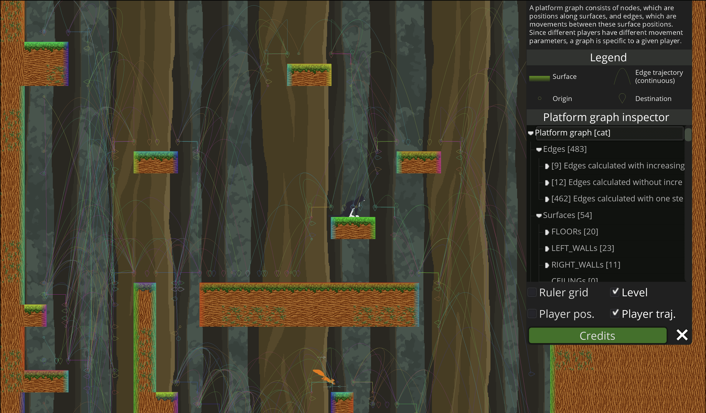
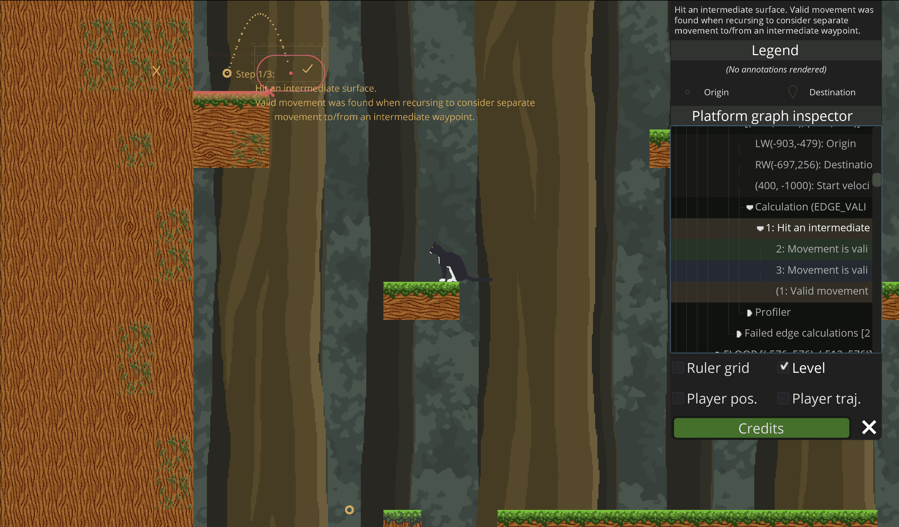

# Platform graph inspector

As you might imagine, the calculations for these edges can get quite complicated. To make these calculations easier to understand and debug, we created a powerful platform graph inspector. This can be accessed from the inspector panel (the gear icon in the top-right corner of the screen).



The inspector is a tree-view widget with the following structure:

```
 - Platform graph [character_name]
   - Edges [#]
     - [#] Edges calculated with increasing jump height
       - JUMP_FROM_SURFACE_EDGEs [#]
         - [(x,y), (x,y)]
           - Profiler
             - ...
           - EDGE_VALID_WITH_INCREASING_JUMP_HEIGHT [1]
             - 1: Movement is valid.
             - ...
         - ...
       - ...
     - [#] Edges calculated without increasing jump height
       - ...
     - [#] Edges calculated with one step
       - ...
   - Surfaces [#]
     - FLOORs [#]
       - [(x,y), (x,y)]
         - _# valid outbound edges_
         - _Destination surfaces:_
         - FLOOR [(x,y), (x,y)]
           - JUMP_FROM_SURFACE_EDGEs [#]
             - [(x,y), (x,y)]
               - Profiler
                 - ...
               - EDGE_VALID_WITH_INCREASING_JUMP_HEIGHT [1]
                 - 1: Movement is valid.
                 - ...
             - ...
             - Failed edge calculations [#]
               - REASON_FOR_FAILING [(x,y), (x,y)]
                 - Profiler
                   - ...
                 - REASON_FOR_FAILING [#]
                   - 1: Step result info
                     - 2: Step result info
                     - ...
                   - ...
                 - ...
               - ...
           - ...
         - ...
       - ...
     - ...
   - Profiler
     - ...
     - Global counts
       - # total surfaces
       - # total edges
       - # JUMP_FROM_SURFACE_EDGEs
       - ...
```

Each entry in this inspector tree is encoded with annotation information which will render debugging info over the level for the corresponding entity. Additionally, each entry contains a detailed description. These are both shown when selecting the entry.


