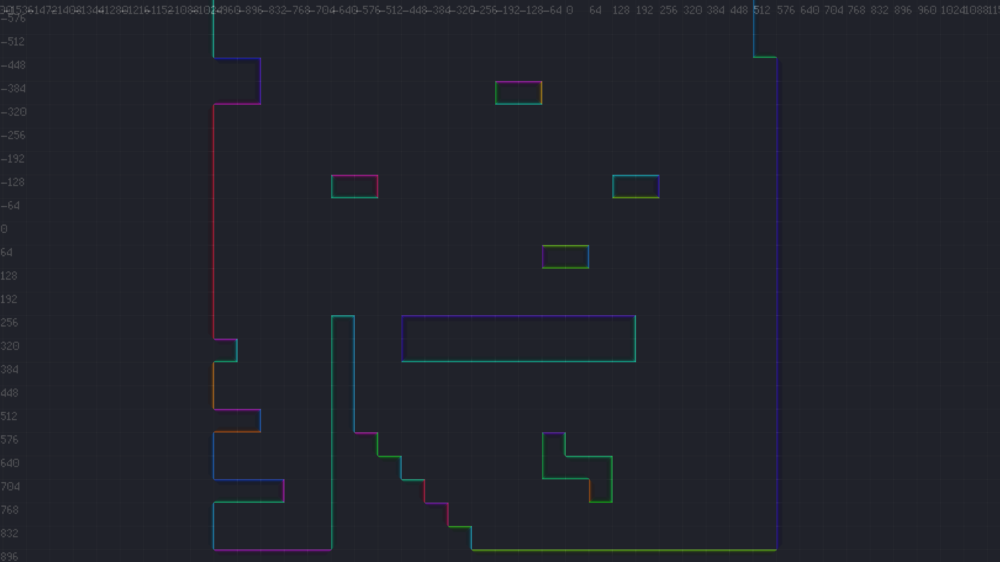

# Platformer AI

> _You can also read more about how Surfacer's AI and movement works in [this **extended tutorial**](https://levi.dev/platformer-ai)._

## The platform graph: Pre-parsing the world

Surfacer depends on the level being represented as a [`TileMap`](https://docs.godotengine.org/en/stable/classes/class_tilemap.html#class-tile_map).

In order for our AI to traverse our world, we first need to parse the world into a platform graph. We do this up-front, when the level is loaded, so that we can efficiently search the graph at run time. Dynamic updates to the graph can be performed at runtime, but these could be expensive if not done with care.

The nodes of this graph correspond to positions along distinct surfaces. Since our characters can walk on floors, climb on walls, and climb on ceilings, we store floor, wall, and ceiling surfaces.

The edges of this graph correspond to a type of movement that the character could perform in order to move from one position on a surface node to another.
-   These edges are directional, since the character may be able to move from A to B but not from B to A.
-   The ends of an edge could be along the same surface or on different surfaces (e.g., for climbing up a wall vs jumping from a floor).
-   There could be multiple edges between a single pair of nodes, since there could be multiple types of movement that could get the character from the one to the other.
-   These edges are specific to a given character type. If we need to consider a different character that has different movement parameters, then we need to calculate a separate platform graph for that character.

## Nodes: Parsing a Godot `TileMap` into surfaces

> **NOTE:** The following algorithm assumes that the given `TileMap` only uses tiles with convex collision boundaries.

### Parse individual tiles into their constituent surfaces

-   Map each `TileMap` cell into a polyline that corresponds to the top-side/floor portion of its collision polygon.
    -   Calculate whether the collision polygon's vertices are specified in a clockwise order.
        -   Use this to determine the iteration step size.
            -   `step_size = 1` if clockwise; `step_size = -1` if counter-clockwise.
        -   Regardless of whether the vertices are specified in a clockwise order, we will iterate over them in clockwise order.
    -   Find both the leftmost and rightmost vertices.
    -   Start with the leftmost vertex.
        -   If there is a wall segment on the left side of the polygon, then this vertex is part of it.
        -   If there is no wall segment on the left side of the polygon, then this vertex must be the cusp between a preceding bottom-side/ceiling segment and a following top-side/floor segment (i.e., the previous segment is underneath the next segment).
            -   Even if there is no segment along one side, we store a surface for that side; this surface is only represented by a single point.
    -   Iterate over the following vertices until we find a non-wall segment (this could be the first segment, the one connecting to the leftmost vertex).
        -   Wall segments are distinguished from floor/ceiling segments according to their angle. This is configurable, but typically, a segment up to 45-degrees is a floor/ceiling and a segment steeper than 45-degrees is a wall.
    -   This non-wall segment must be the start of the top-side/floor polyline.
    -   Iterate, adding segments to the result polyline, until we find either a wall segment or the rightmost vertex.
    -   We then also save a mapping from a `TileMap` cell index to each of the different surfaces we've calculated as existing in that cell.
-   Repeat the above process for the right-side, left-side, and bottom-side surfaces.

### Remove internal surfaces

> **NOTE:** This will only detect internal surface segments that are equivalent with another internal segment. But for grid-based tiling systems, this can often be enough.

-   Check for pairs of floor+ceiling segments or left-wall+right-wall segments, such that both segments share the same vertices.
-   Remove both segments in these pairs.

### Merge any connecting surfaces

-   Iterate across each floor surface A.
-   Nested iterate across each other floor surface B.
    -   Ideally, we should be using a spatial data structure that allows us to only consider nearby surfaces during this nested iteration (such as an R-Tree).
-   Check whether A and B form a "continuous" surface.
    -   A and B are both polylines that only have two end points.
    -   Just check whether either endpoint of A equals either endpoint of B.
        -   Actually, our original `TileMap` parsing results in every surface polyline being stored in clockwise order, so we only need to compare the end of A with the start of B and the start of A with the end of B.
-   If they do:
    -   Merge B into A.
    -   Optionally, remove any newly created redundant internal colinear points.
    -   Remove B from the surface collection.
-   Repeat the iteration until no merges were performed.

### Record adjacent neighbor surfaces

-   Every surface should have both adjacent clockwise and counter-clockwise neighbor surfaces.
-   Use a similar process as above for finding surfaces with matching end positions.

## Edges: Calculating jump movement trajectories

**tl;dr**: The Surfacer framework uses a procedural approach to calculate trajectories for movement between surfaces. The algorithms used rely heavily on the classic [one-dimensional equations of motion for constant acceleration](https://physics.info/motion-equations/). These trajectories are calculated to match to the same abilities and limitations that are exhibited by corresponding player-controlled movement. After the trajectory for an edge is calculated, it is translated into a simple instruction/input-key start/end sequence that should reproduce the calculated trajectory.

> **NOTE:** A machine-learning-based approach would probably be a good alternate way to solve this general problem. However, one perk of a procedural approach is that it's relatively easy to understand how it works and to modify it to perform better for any given edge-case (and there are a _ton_ of edge-cases).

### The high-level steps

-   Determine how high we need to jump in order to reach the destination.
-   If the destination is out of reach (vertically or horizontally), ignore it.
-   Calculate how long it will take for vertical motion to reach the destination from the origin.
-   We will define the movement trajectory as a combination of two independent components: a "vertical step" and a "horizontal step". The vertical step is based primarily on on the jump duration calculated above.
-   Calculate the horizontal step that would reach the destination displacement over the given duration.
-   Check for any unexpected collisions along the trajectory represented by the vertical and horizontal steps.
    -   If there is an intermediate surface that the character would collide with, we need to try adjusting the jump trajectory to go around either side of the colliding surface.
        -   We call these points that movement must go through in order to avoid collisions, "waypoints".
        -   Recursively check whether the jump is valid to and from either side of the colliding surface.
        -   If we can't reach the destination when moving around the colliding surface, then try backtracking and consider whether a higher jump height from the start would get us there.
    -   If there is no intermediate collision, then we can calculate the ultimate edge movement instructions for playback based on the vertical and horizontal steps we've calculated.

### Some important aspects

-   We treat horizontal and vertical motion as independent to each other. This greatly simplifies our calculations.
    -   We calculate the necessary jump duration--and from that the vertical component of motion--up-front, and use this to determine times for each potential step and waypoint of the motion. Knowing these times up-front makes the horizontal min/max calculations easier.
-   We have a broad-phase check to quickly eliminate possible surfaces that are obviously out of reach.
    -   This primarily looks at the horizontal and vertical distance from the origin to the destination.

### Calculating "good" potential jump and land positions

Deciding which jump and land positions to base an edge calculation off of is non-trivial. We could just try calculating edges for a bunch of different jump/land positions for a given pair of surfaces. But edge calculations aren't cheap, and executing too many of them impacts performance. So it's important that we carefully choose "good" jump/land positions that have a relatively high likelihood of producing a valid and efficient edge.

Additionally, when jumping from a floor, we need to determine what initial horizontal velocity to use for the edge calculation. This horizontal start velocity can then influence the jump/land positions.

-   Some interesting jump/land positions for a surface include the following:
    -   Either end of the surface.
    -   The closest position along the surface to either end of the other surface.
        -   This closest position, but with a slight offset to account for the width of the character.
        -   This closest position, but with an additional offset to account for horizontal or vertical displacement with minimum jump time and maximum horizontal velocity.
            -   This offset becomes important when considering jumps that start with max-speed horizontal velocity, which could otherwise overshoot the land position if we didn't account for the offset.
    -   The closest interior position along the surface to the closest interior position along the other surface.
    -   The position along a horizontal surface that is behind the overall connected region that the vertical land surface is a part of.
        -   This position is important if we need to consider movement around behind a wall that then lands on the top of the wall.
-   We try to minimize the number of jump/land positions returned, since having more of these greatly increases the overall time to parse the platform graph.
-   We usually consider surface-interior points before surface-end points (which usually puts shortest distances first).
-   We also decide start velocity when we decide the jump/land positions.
    -   We only ever consider start velocities with zero or max speed.
-   Additionally, we often quit early as soon as we've calculated the first valid edge for a given pair of surfaces.
    -   In order to decide whether to skip an edge calculation for a given jump/land position pair, we look at how far away it is from any other jump/land position pair that we already found a valid edge for, on the same surface, for the same surface pair. If it's too close, we skip it.
    -   This is another important performance optimization.

Unfortunately, most jump/land position calculations are highly dependent on the types and spatial arrangement of the two surfaces. There are many possible combinations, and the most of these combinations must be considered individually. The following diagrams illustrate the many different jump/land combinations.

### Calculating the start velocity for a jump

-   In the general case, we can't know at build-time what direction along a surface the character will
    be moving from when they need to start a jump.
-   Unfortunately, using start velocity x values of zero for all jump edges tends to produce very
    unnatural composite trajectories (similar to using perpendicular Manhatten distance routes
    instead of more diagonal routes).
-   So, we can assume that for surface-end jump-off positions, we'll be approaching the jump-off
    point from the center of the edge.
-   And for most edges we should have enough run-up distance in order to hit max horizontal speed
    before reaching the jump-off point--since horizontal acceleration is relatively quick.
-   Also, we only ever consider velocity-start values of zero or max horizontal speed. Since the
    horizontal acceleration is quick, most jumps at run time shouldn't need some medium-speed. And
    even if they did, we force the initial velocity of the jump to match expected velocity, so the
    jump trajectory should proceed as expected, and any sudden change in velocity at the jump start
    should be acceptably small.

### Calculating the total jump duration (and the vertical step for the edge)

-   At the start of each edge-calculation traversal, we calculate the minimum total time needed to reach the destination.
    -   If the destination is above, this might be the time needed to rise that far in the jump.
    -   If the destination is below, this might be the time needed to fall that far (still taking into account any initial upward jump-off velocity).
    -   If the destination is far away horizontally, this might be the time needed to move that far horizontally (taking into account the horizontal movement acceleration and max speed).
    -   The greatest of these three possibilities is the minimum required total duration of the jump.
-   The minimum peak jump height can be determined from this total duration.
-   All of this takes into account our variable-height jump mechanic and the difference in slow-ascent and fast-fall gravities.
    -   With our variable-height jump mechanic, there is a greater acceleration of gravity when the character either is moving downward or has released the jump button.
    -   If the character releases the jump button before reaching the maximum peak of the jump, then their current velocity will continue pushing them upward, but with the new stronger gravity.
    -   To determine the duration to the jump peak height in this scenario, we first construct two instances of one of the basic equations of motion--one for the former part of the ascent, with the slow-ascent gravity, and one for the latter part of the ascent, with the fast-fall gravity. We then use algebra to substitute the equations and solve for the duration.

### Calculating the horizontal steps in an edge

-   If we decide whether a surface could be within reach, we then check for possible collisions between the origin and destination.
    -   To do this, we simulate frame-by-frame motion using the same physics timestep and the same movement-update function calls that would be used when running the game normally. We then check for any collisions between each frame.
-   If we detect a collision, then we define two possible "waypoints"--one for each end of the collided surface.
    -   In order to make it around this intermediate surface, we know the character must pass around one of the ends of this surface.
    -   These waypoints we calculate represent the minimum required deviation from the character's original path.
-   We then recursively check whether the character could move to and from each of the waypoints.
    -   We keep the original vertical step and overall duration the same.
    -   We can use that to calculate the time and vertical state that must be used for the waypoint.
    -   Then we only really consider whether the horizontal movement could be valid within the the given time limit.
-   If so, we concatenate and return the horizontal steps required to reach the waypoint from the original starting position and the horizontal steps required to reach the original destination from the waypoint.

### Backtracking to consider a higher max jump height

-   Sometimes, a waypoint may be out of reach, when we're calculating horizontal steps, given the current step's starting position and velocity.
-   However, maybe the waypoint could be within reach, if we had originally jumped a little higher.
-   To account for this, we backtrack to the start of the overall movement traversal and consider whether a higher jump could reach the waypoint.
    -   The destination waypoint is first updated to support a new jump height that would allow for a previously-out-of-reach intermediate waypoint to also be reached.
    -   Then all steps are re-calculated from the start of the movement, while considering the new destination state.
-   If it could, we return that result instead.

### Waypoint calculations

-   We calculate waypoints before steps.
    -   We calculate a lot of state to store on them, and then depend on this state during step calculation.
    -   Some of this state includes:
        -   The time for passing through the waypoint (corresponding to the overall jump height and edge duration).
        -   The horizontal direction of movement through the waypoint (according to the direction of travel from the previous waypoint or according to the direction of the surface).
        -   The min and max possible x-velocity when the movement passes through this waypoint.
            -   With a higher speed through a waypoint, we could reach further for the next waypoint, or we could be stuck overshooting the next waypoint. So it's useful to calculate the range of possible horizontal velocities through a waypoint.
        -   The actual x-velocity for movement through the waypoint is calculated later when calculating the cooresponding movement step.
            -   We typically try to use an x-velocity that will minimize speed through the waypoint, while still satisfying the horizontal step displacement and the waypoint's min/max limitations.
-   Here's the sequence of events for waypoint calculations:
    -   Start by calculating origin and destination waypoints.
        -   For the origin waypoint, min, max, and actual x-velocity are all zero.
        -   For the destination waypoint, min and max are assigned according to how acceleration can be applied during the step (e.g., at the start or at the end of the interval).
    -   Then, during step calculation traversal, when a new intermediate waypoint is created, its min and max x-velocity are assigned according to both the min and max x-velocity of the following waypoint and the actual displacement and duration of the step from the new waypoint to the next waypoint.
    -   Intermediate waypoints are calculated with pre-order tree traversal.
      -   This poses a small problem:
        -   The calculation of a waypoint depends on the accuracy of the min/max x-velocity of it's next waypoint.
        -   However, the min/max x-velocity of the next waypoint could need to be updated if it in turn has a new next waypoint later on.
        -   Additionally, a new waypoint could be created later on that would become the new next waypoint instead of the old next waypoint.
        -   To ameliorate this problem, everytime a new waypoint is created, we update its immediate neighbor waypoints.
        -   These updates do not solve all cases, since we may in turn need to update the min/max x-velocities and movement sign for all other waypoints. And these updates could then result in the addition/removal of other intermediate waypoints. But we have found that these two updates are enough for most cases. If we detect that a neigbor waypoint would be invalidated during an update, we abandon the edge calculation, which could result in a false-negative result.
    -   Steps are calculated with in-order tree traversal (i.e., in the same order they'd be executed when moving from origin to destination).

### Fake waypoints

-   When calcuting steps to navigate around a collision with a ceiling or floor surface, sometimes one of the two possible waypoints is what we call "fake".
-   A fake waypoint corresponds to the left side of the floor/ceiling surface when movement from the previous waypoint is rightward (or to the right side when movement is leftward).
-   In this case, movement will need to go around both the floor/ceiling as well as its adjacent wall surface.
-   The final movement trajectory should not end-up moving through the fake waypoint.
-   The actual waypoint that the final movement should move through, is instead the "real" waypoint that cooresponds to the far edge of this adjacent wall surface.
-   So, when we find a fake waypoint, we immediately replace it with its adjacent real waypoint.
-   Example scenario:
    -   _(The following section illustrates this example.)_
    -   Origin is waypoint #0, Destination is waypoint #3
    -   Assume we are jumping from a low-left platform to a high-right platform, and there is an intermediate block in the way.
    -   Our first step attempt hits the underside of the block, so we try waypoints on either side.
    -   After trying the left-hand waypoint (#1), we then hit the left side of the block. So we then try a top-side waypoint (#2).
        -   (Bottom-side fails the surface-already-encountered check).
    -   After going through this new left-side (right-wall), top-side waypoint (#2), we can successfully reach the destination.
    -   With the resulting scenario, we shouldn't actually move through both of the intermediate waypoints (#1 and #2). We should should instead skip the first intermediate waypoint (#1) and go straight from the origin to the second intermediate waypoint (#2).

### An illustrated example of edge calculation with backtracking

#### The resulting edge

-   This shows the final edge jump trajectory that we are calculating.
-   We're jumping from the lower floor surface to the upper floor surface.
-   And we're moving around the upper wall surface.

#### Step 1

-   This shows that when we consider naïve horizontal motion, we hit the lower-side of the platform.
-   This means that we will need to go through a waypoint around either side of the platform.
-   However, with the original jump height we were considering, we couldn't reach either waypoint.
-   So we will need to backtrack and consider a greater jump height.

#### Step 2

-   This shows that we have backtracked in our calculations in order to consider a higher jump height.
-   We are still colliding with the underside of the platform, but now we can reach one of the waypoints around the platform.

#### Step 3

-   This shows that we can successfully move from the origin to the intermediate waypoint.
-   This means that we didn't collide with anything else on the way there.
-   Also, this mentions that this calculation involved a "fake" waypoint (outside the lower-left corner), and we replaced this with a "real" waypoint (outside the upper-left corner), since we didn't actually want to move through the lower-left-corner waypoint.

#### Step 4

-   This shows that we can successfully move from our intermediate waypoint to the original destination.
-   Now we can create the final edge trajectory by simply concatenating the parts leading to and from this intermediate waypoint.

### Collision calculation madness

**tl;dr**: Godot's collision-detection engine isn't perfect. We try to make it work for our
pathfinding, but there are still false negatives and rough edges.

Here's a direct quote from a comment in Godot's underlying collision-calculation logic:

> give me back regular physics engine logic 
> this is madness 
> and most people using this function will think 
> what it does is simpler than using physics 
> this took about a week to get right.. 
> but is it right? who knows at this point.. 

(https://github.com/godotengine/godot/blob/a7f49ac9a107820a62677ee3fb49d38982a25165/servers/physics_2d/space_2d_sw.cpp#L692)

Some known limitations and rough edges include:
-   When a [`KinematicBody2D`](https://docs.godotengine.org/en/stable/classes/class_kinematicbody2d.html) is sliding around a corner of another collidable, Godot can sometimes calculate the wrong results (oppositite direction) for the collision normal, which can lead you to believe the character is colliding with the opposite-side wall.
    -   This error might stem from an assumption that the direction of motion won't be in the same direction as the surface normal, which is unusual, but happens in this case.
-   Similarly, Godot can also sometimes report two collisions instead of one, when it thinks that the character might be intersecting an interior surface.
-   Inconsistency between the behavior of the [`KinematicBody2D`](https://docs.godotengine.org/en/stable/classes/class_kinematicbody2d.html) and [`Physics2DDirectSpaceState`](https://docs.godotengine.org/en/stable/classes/class_physics2ddirectspacestate.html) collision APIs.
    -   We were originally using the Physics2DDirectSpaceState for most of our graph calculations. However, this API seems to be more broken than the KinematicBody2D API. Also, we're using the KinematicBody2D API at run time, so we see more consistent results by using the KinematicBody2D API at build time as well.

## SurfaceNavigator: Using the platform graph to move from A to B

Once the platform graph has been parsed, finding and moving along a path through the graph is relatively straight-forward.

The sequence of events looks like the following:

-   Given a target point to navigate towards and the character's current position.
-   Find the closest point along the closest surface to the target point.
-   Use A* search to find a path through the graph from the origin to the destination.
    -   We can use distance or duration as the edge weights.
-   Execute playback of the instruction set for each edge of the path, in sequence.

> The green character is controlled by player clicks. The orange character is controlled by AI behaviors.

### Dynamic edge optimization according to runtime approach

At runtime, after finding a path through build-time-calculated edges, we try to optimize the jump-off points of the edges to better account for the direction that the character will be approaching the edge from.

-   This produces more efficient and natural movement.
-   The build-time-calculated edge state would only use surface end-points or closest points.
-   We also take this opportunity to update start velocities to exactly match what is allowed from the ramp-up distance along the edge, rather than either the fixed zero or max-speed value used for the build-time-calculated edge state.

> An unoptimized path.

> An optimized path. Notice how the jump-off points from the upper floor surfaces produce less-perpendicular angles.

### Edge instructions playback

When we initially calculate the edges, we also store the sequence of instructions that would produce the edge's movement.

Each instruction defines the following:

-   An ID for the relevant input key
-   Whether the key is being pressed or released.
-   The time.

The character movement system can then handle these input key events in the same way as actual player-triggered input key events.

> Instruction input corresponding to the jump trajectory.

-   An arrow represents a key-down event.
-   An arrow with a slash represents a key-up event.
-   So, from start to end, the instructions for this jump trajectory are:
    -   jump-down
    -   right-down
    -   right-up
    -   jump-up
-   The jump-down input isn't shown explicitly.

### Correcting for runtime vs buildtime trajectory discrepancies

When executing edge instructions, the resulting runtime trajectory is usually slightly off from the expected trajectory that was pre-calculated when creating the edge. This variance is usually pretty minor, but, just in case, a given character can be configured to use the exact pre-calculated edge trajectory rather than the runtime version.

Theoretically, we should be able to fix our calculations and eliminate this discrepancy, but it's difficult to get these things just right.

> Runtime movement differs slightly from what we calculate at build-time.

-    The slightly-more-grey lower arc represents "continuous" movement.
    -    These are frame-by-frame positions that were calculated according to classic one-dimensional equations of motion for constant acceleration that look at the expected state for the current time relative to the overall start of the jump.
    -    These represent more-accurate and more-predictable movement according to our physics rules.
    -    With this approach, any position-calculation errors stay insignificant over time.
    -    We use this trajectory for correcting character positions at runtime.
-    The slightly-more-colorful upper arc represents "discrete" movement.
    -    These are frame-by-frame positions that were calculated according to isolated acceleration/velocity/position updates that are just relative to the state from previous frame.
    -    These better represent the movement that would actually happen at runtime, since runtime movement is only based off discrete updates to the state left from the previous frame.
    -    With this approach, position-calculation errors tends to become gradually larger over time.
        -    You can see at the end of the arc that there is an abrupt cusp near the end-point, since the trajectory didn't line-up perfectly with the expected destination.

### Dynamic edge calculation for in-air origins or destinations

We only store surface-to-surface edges in our platform graph, since it wouldn't make sense to try to account for all possible in-air end points ahead of time.

But it is easy to calculate an edge to or from a specific in-air position and include this in our navigation as needed.

> Starting and ending at in-air positions.
